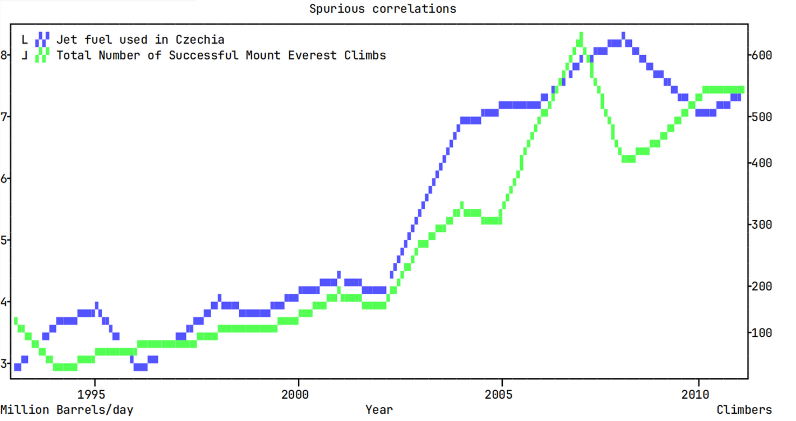
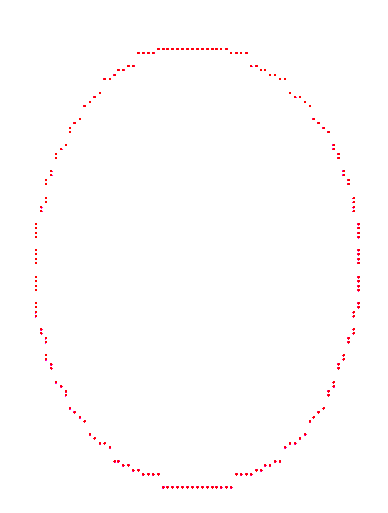

<!-- theme: uncover -->

<!-- class: title-page -->

<style>
    @import url('./tweaks.css');
</style>

# ▃█▅

## Terminal plotting

### Python Pizza Brno 2025

---

<!-- class: normal-page -->



---

# Why?

---

# How?

---

## Modern Terminal

- ANSI codes
- Normal / alternate buffer

---

## Characters

ASCII

```
. / - \ + # o
```

Unicode

```

```

---

## Colours

- 16 default colours (customisable!)

- 240 additional colours (fixed palette)

- 24bit true colours

---

# Enough reinventing the wheel



---

## plotille

---

## plotext

---

## What if...

---

## ...you could actually display any matplotlib plot in the terminal?

🙈

---

## kitty protocol

:neo-disapproving-face:
